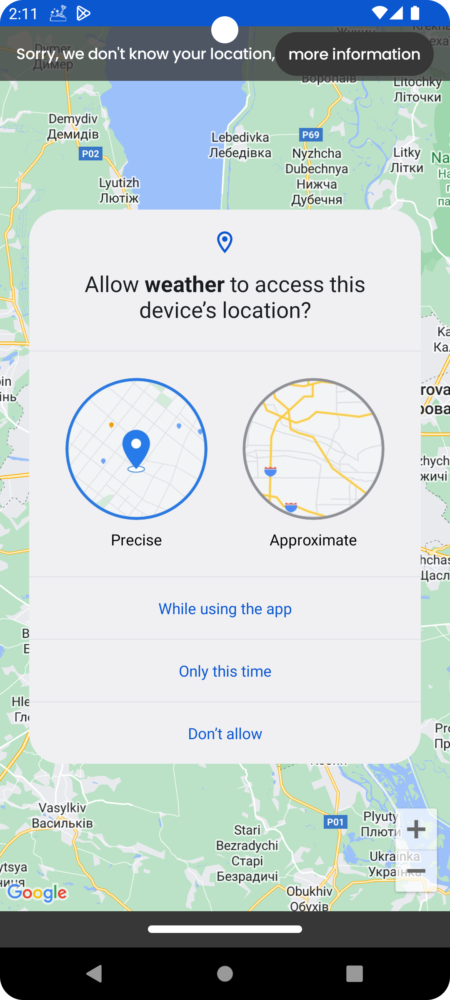
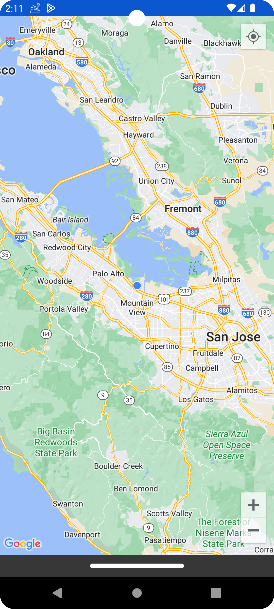
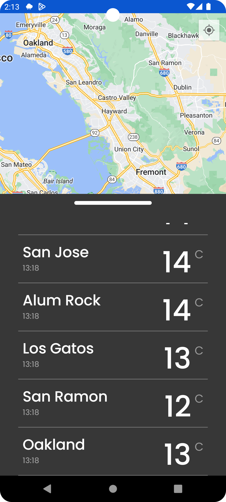
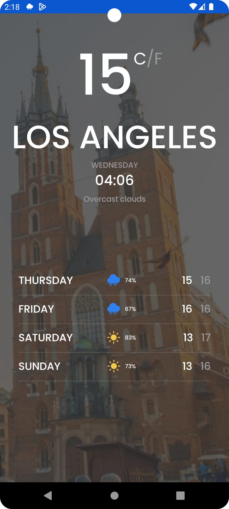
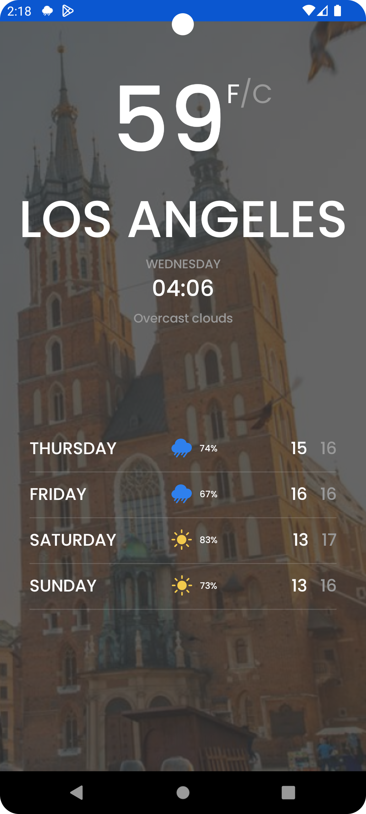
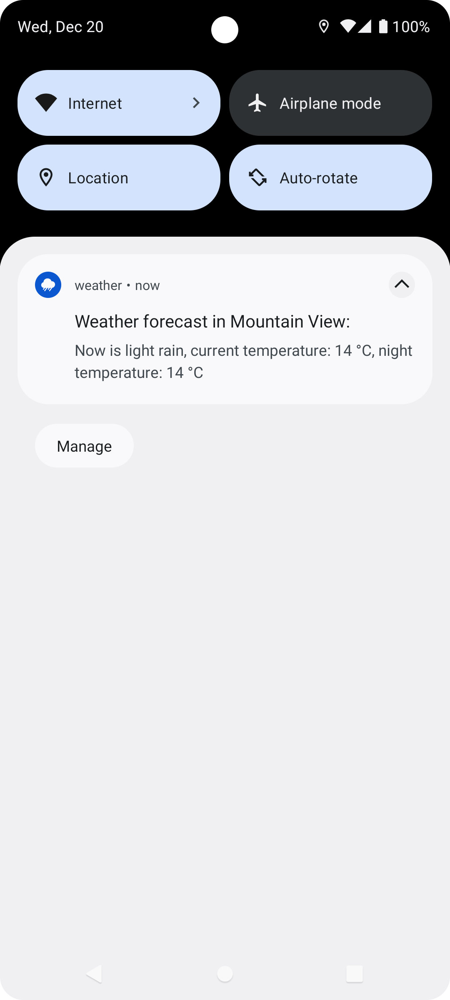
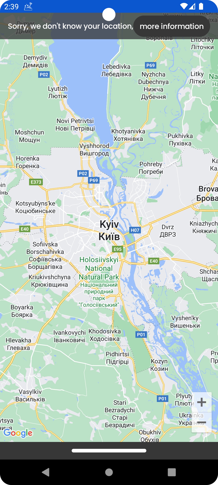
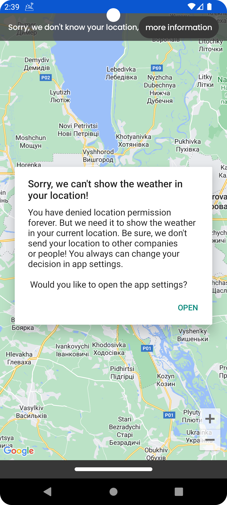
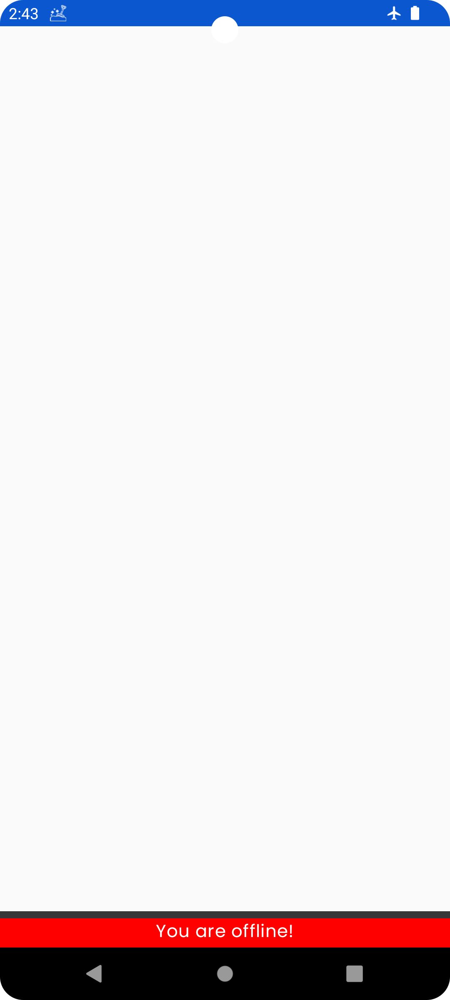

# Welcome to the Weather Forecast Project!

Greetings! I'm Andrii, thrilled to introduce you to the Weather Forecast project.

## Tools & Technologies Used:

- Kotlin
- Android Framework
- Jetpack Compose
- Google Maps API
- Retrofit
- Kotlin Flow
- Koin DI
- Broadcast Receiver
- WorkManager
- Foreground Service
- Compose Navigation
- Permissions handling
- Clean architecture
- JUnit
- Compose UI testing
- Mockito

This project is designed to provide weather forecasts for various cities using map selection. Simply navigate to your preferred area and select the desired city.

## Project overview:

### Initial Permission Request:
Upon launching the app, you'll encounter a dialog requesting location permission:

### Permission accepted, map screen:
Once permission is granted, the map showcasing your current location is displayed:

### Bottom sheet content:
The app incorporates a bottom sheet displaying a list of cities. This list dynamically updates based on the area around the center of your screen:

As you navigate the map or adjust zoom levels, the list refreshes automatically.

### Detailed weather forecast:
To access the weather forecast for a specific city, simply click on the desired line:

Users can seamlessly toggle between Celsius and Fahrenheit by clicking on the respective icons:

### Weather notification:
The app sends location-based notifications with weather information:

### Permission denied:
In case the user denies location permission, a small message appears at the top of the screen:

Clicking "more information" provides detailed insights into the permission:

The "Open" button directs users to app settings where they can adjust their decision.

### Internet connection observing:
The app relies on an active internet connection without caching. When the connection is lost, it displays an empty screen with a message at the bottom:

To explore different approaches, I've implemented notification functionality in two ways:

- WorkManager: Offers flexibility but has a limitation of 15-minute delay.
- Foreground Service: Chosen to showcase notifications every minute(task's requirement).

Thank you for your interest in my project! Feel free to delve into the code and project structure. Should you have any queries or suggestions, please reach out!

## My contacts:

[LinkedIn](https://www.linkedin.com/in/andrii-seleznov-32142721a/)

[Email](https://mail.google.com/mail/?view=cm&to=seleznov.andriy@gmail.com)